# 系统介绍

 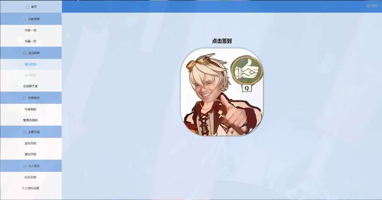

 本小组设计了一个阅读论坛管理系统。该系统实现了书籍的添加、删除、查询以及用户之间相互添加好友、聊天功能、抽卡功能等，同时提供了用户登录、注册和管理员权限设置等功能。本人主要为后端负责人，负责后端框架开发及向前端提供接口

主要技术栈为：

Spring boot + mybatis + mysql + websocket + AOP 集成阿里云文件上传，支付宝支付

# 开发计划

# 后端

## 项目结构设计

## 数据库表结构设计
### 书籍表
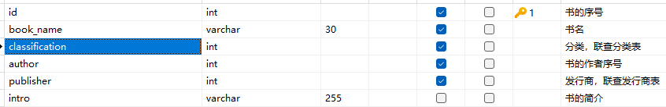
### 发行商表；
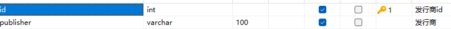
### 作者表；
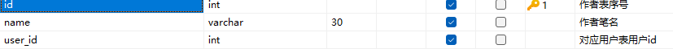
### 用户表
 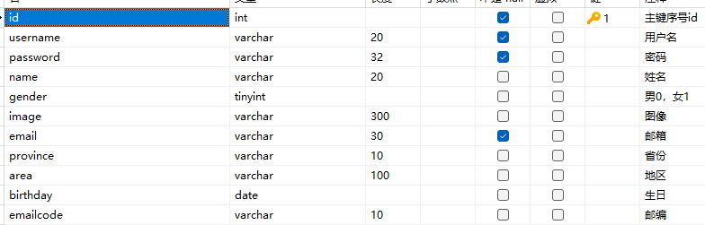
### 订单表；
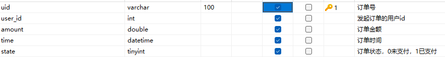
### 余额表；
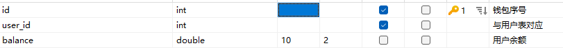
### 好友状态维护表
 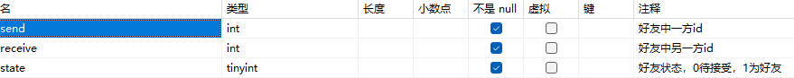
### 消息状态维护表
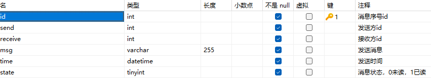
### 操作记录表
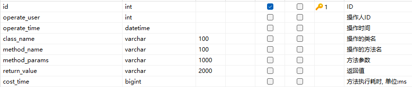

## 项目主要实现
### 调用官方API生成和解析JWT令牌

### 设置登录拦截器

> 1.生成token时使用了用户信息和用户权限
>
> 2.拦截请求解析令牌时进行了身份验证和权限管理

### swagger管理接口文档

### 集成支付宝支付

> 1.新建支付宝配置类从yml导入相关配置
>
> 2.实现前端调用接口使用支付宝SDK生成表单写入响应体返回

> 3.设置回调地址，编写回调实现

### 切面编程记录增删改操作

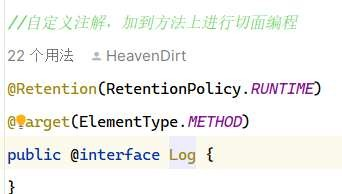 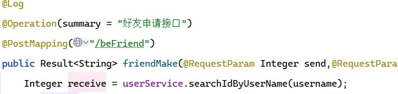

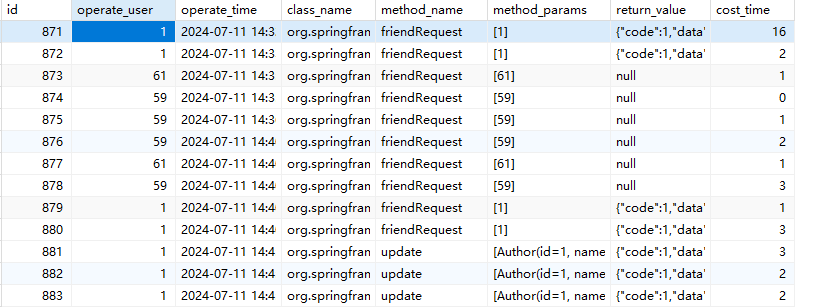

### 简单抽卡模型

> 扩展点：可增加卡的类型，可增加卡的稀有度表

> 伪随机稀有度区间划分

# 多人聊天

### 1.好友申请

> 通过好友申请表存储好友信息，0为待接受，1是成为好友

> 如果请求方在线，通过websocket通知前端进行请求列表更新拉取

### 2.聊天

> 1.将消息存储在数据库中
>
> 2.如果消息接收方在线将使用websocket通知前端进行实时刷新
>
> 3.通过接口将消息返还给前端

### 3.列表状态获取

> 实现将好友间最新消息，未读消息数返回给前端并更新消息为已读状态

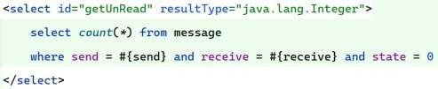

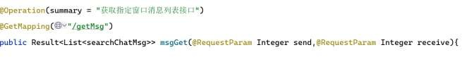

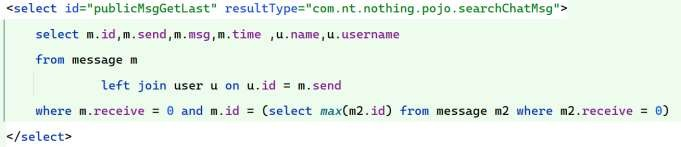

# 功能展示

## 主页面

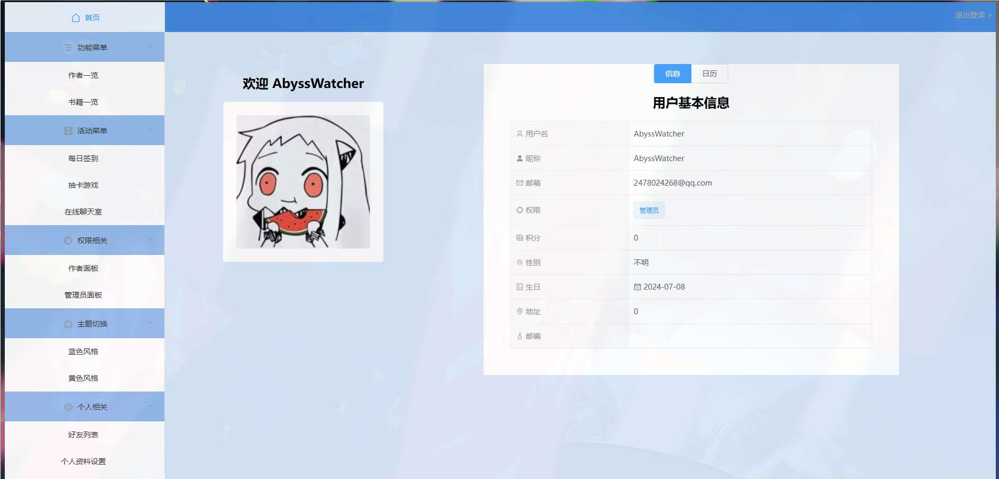

## 作者一览

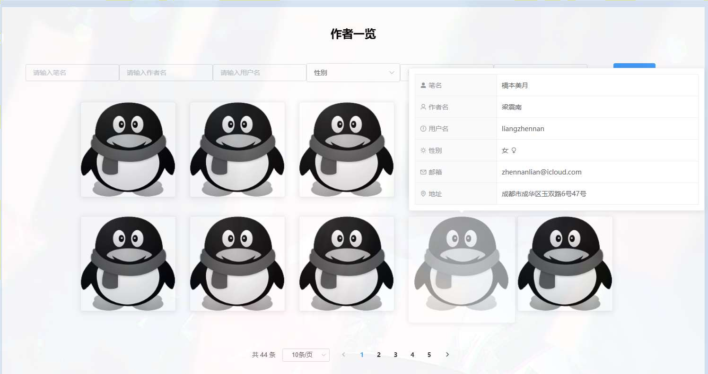

## 书籍一览

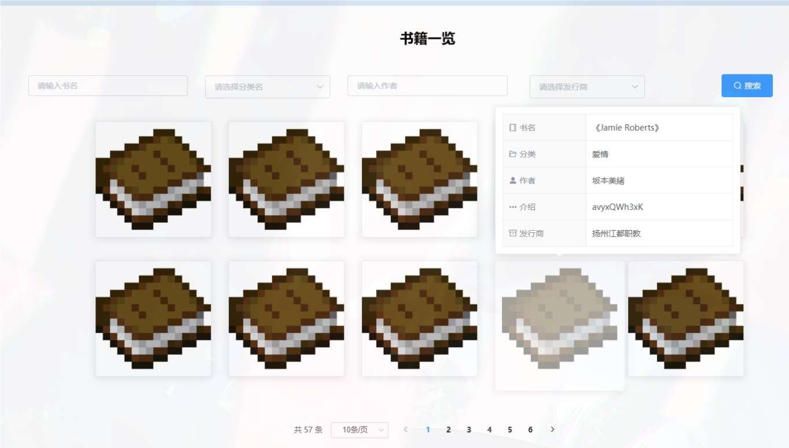

## 签到

## 充值界面

## 抽卡界面

## 聊天室
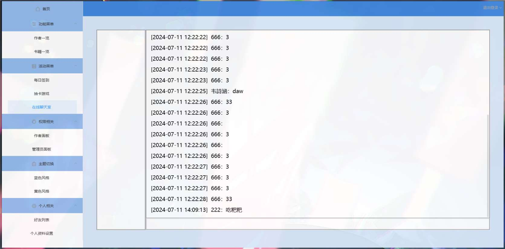
## 作者面板
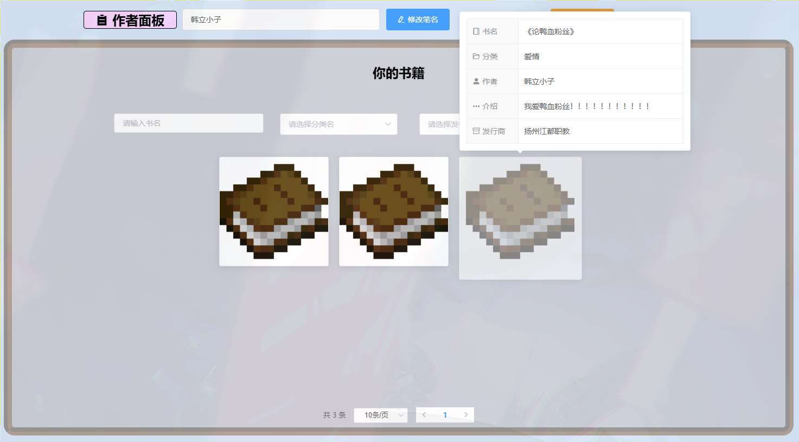

## 管理员面板

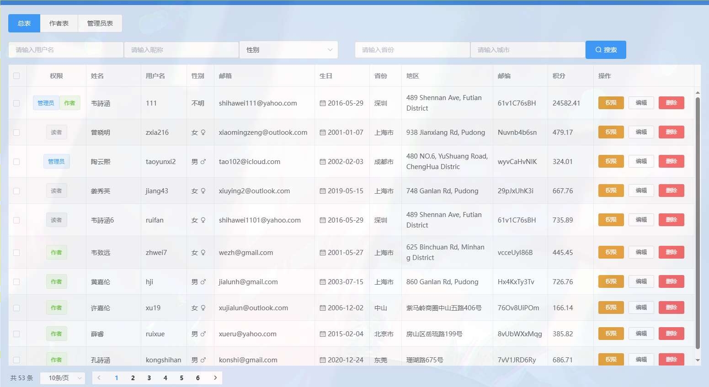
## 好友列表和私人聊天

## 个人资料修改
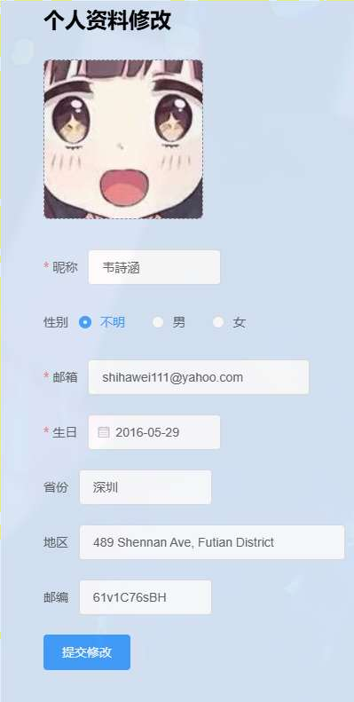
